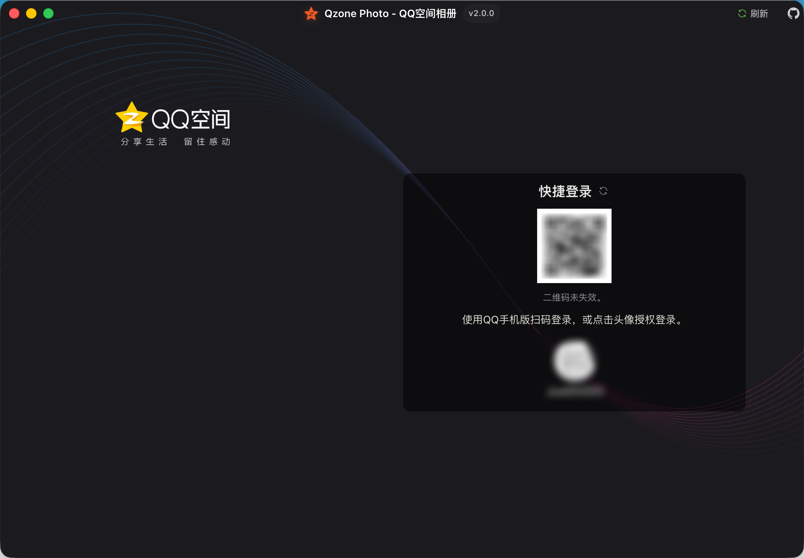
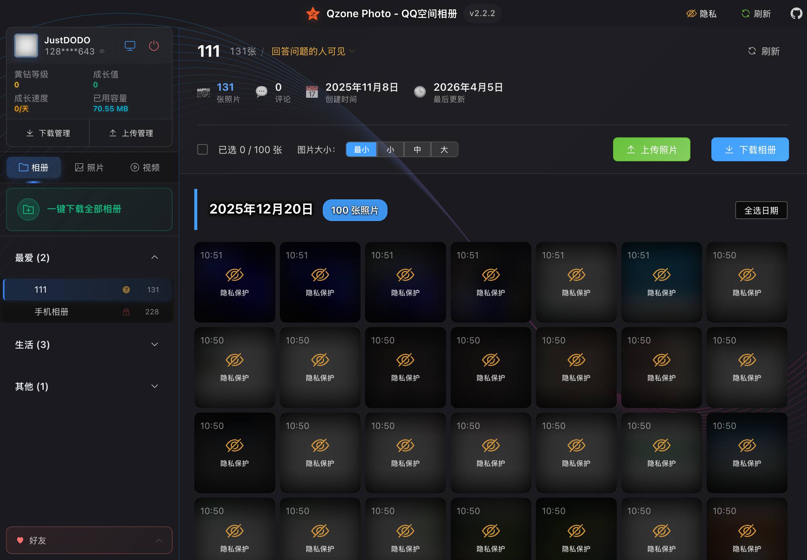
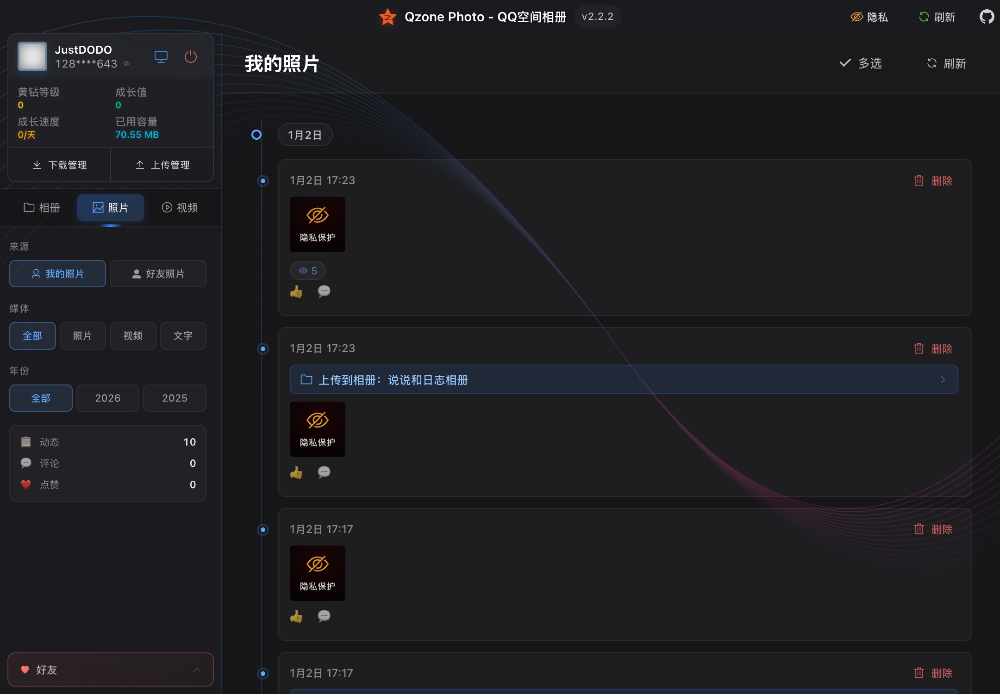
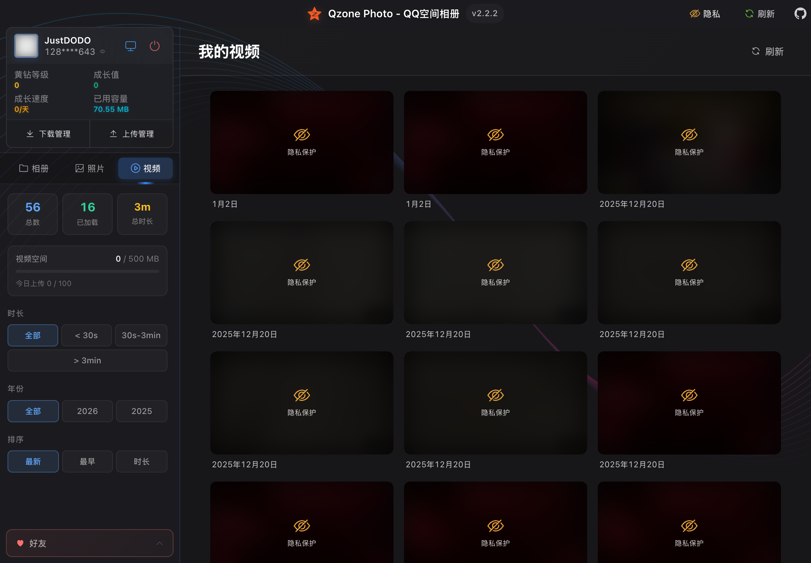
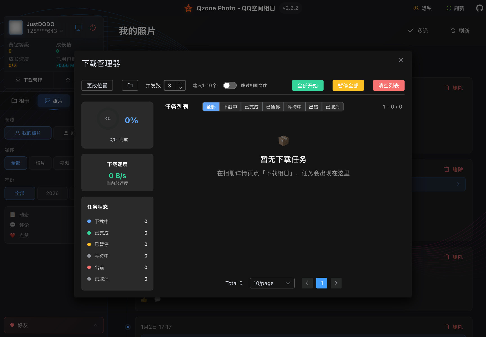

<div align="center">


<h1>Qzone Photo</h1>

<p>
功能强大的QQ空间管理工具<br/>
支持相册下载、照片/视频上传，让你的空间回忆管理更轻松 ✨
</p>

<p>
<a href="https://github.com/11273/QzonePhoto/releases">
<strong>📥 立即下载</strong>
</a>
 · 
<a href="#-快速开始">🚀 快速开始</a>
 · 
<a href="#-功能特性">📺 功能特性</a>
 · 
<a href="#-常见问题解答">❓ 常见问题</a>
</p>

<p>


</p>

</div>

---

## 💝 为什么需要 Qzone Photo？

还记得那些珍藏在QQ空间里的美好回忆吗？

- 🎓 **毕业季的青春照片** - 那些和同窗好友的珍贵合影
- 🌸 **恋爱时光的甜蜜瞬间** - 记录爱情故事的每一个细节
- 👨‍👩‍👧‍👦 **家庭聚会的温馨时刻** - 和家人团聚的快乐时光
- ✈️ **旅行路上的精彩片段** - 世界各地留下的足迹

**时光荏苒，这些回忆太珍贵了，不能只存在云端！**

Qzone Photo 不仅帮助你将这些无价的回忆安全下载到本地，还支持将本地照片/视频上传到QQ空间，让空间管理更加便捷。

## ✨ 功能特性

### 📥 相册下载

- **批量下载相册**：支持一键下载所有相册或选择性下载
- **照片与视频**：同时支持照片和视频内容下载
- **断点续传**：意外中断也不怕，继续下载不重复
- **智能分类**：按QQ号和相册名自动整理文件
- **原始画质**：保持照片和视频的原始质量

### 📤 内容上传

- **照片上传**：支持批量上传本地照片到指定相册
- **视频上传**：支持上传视频文件到QQ空间
- **进度跟踪**：实时显示上传进度和状态

### 🎬 媒体预览

- **照片浏览**：高清预览相册中的照片
- **视频播放**：在线播放QQ空间视频
- **隐私模式**：默认开启隐私模糊，保护个人隐私

### 🛡️ 安全可靠

- **官方接口**：使用QQ空间官方API，数据安全有保障
- **本地存储**：所有文件保存在你的电脑上
- **权限控制**：只能操作你有权限访问的内容
- **开源透明**：代码完全公开，接受社区监督

### ⚡ 其他特性

- **跨平台支持**：Windows、macOS、Linux 全平台支持
- **界面简洁**：现代化UI设计，操作简单直观
- **自动更新**：支持应用自动更新到最新版本

## 🚀 快速开始

### 💻 开发环境要求

如果你想从源码运行或参与开发，需要准备以下环境：

- **Node.js**: 建议使用 v18.x 或更高版本
- **包管理器**: pnpm（推荐）

### 🔧 本地运行

1. **克隆项目**

```bash
git clone https://github.com/11273/QzonePhoto.git
cd QzonePhoto
```

2. **安装依赖**

```bash
# 使用 pnpm（推荐）
pnpm install
```

3. **启动开发模式**

```bash
# 开发模式（带热重载）
pnpm dev
```

4. **打包应用**

```bash
# 构建所有平台
pnpm build

# 构建特定平台
pnpm build:win    # Windows
pnpm build:mac    # macOS
pnpm build:linux  # Linux
```

### 📥 直接使用（下载安装包）

#### Windows 系统

- **64位系统**（推荐）：下载 `*-win-x64-setup.exe`
- **32位系统**：下载 `*-win-ia32-setup.exe`
- **不确定**：下载 `*-win-setup.exe`（通用版，文件较大）

#### macOS 系统

- **Apple M系列芯片**（2020年后）：下载 `*-mac-arm64.dmg`
- **Intel芯片**（2020年前）：下载 `*-mac-x64.dmg`
- **DMG打不开**：下载对应的 `.zip` 文件

> 💡 查看芯片：点击  → 关于本机

#### Linux 系统

- **推荐**：下载 `*-linux-x86_64.AppImage`（通用版）
- **Ubuntu/Debian**：下载 `*-linux-amd64.deb`

> 💡 AppImage需要执行权限：`chmod +x *.AppImage`

#### 安装注意事项

- **Windows提示安全警告**：点击"更多信息" → "仍要运行"
- **macOS提示未验证**：系统偏好设置 → 安全性与隐私 → "仍要打开"
- **文件选择**：`.blockmap` 和 `.yml` 文件无需下载

**[👉 前往下载页面](https://github.com/11273/QzonePhoto/releases/latest)**

## 📖 使用指南

### 1️⃣ 登录QQ空间

打开应用后，选择你喜欢的登录方式：

- 📱 **扫码登录**（推荐）：用手机QQ扫一扫，安全快捷
- 💻 **本地登录**：直接使用电脑上已登录的QQ



### 2️⃣ 浏览相册

登录成功后，可以看到所有可访问的相册列表，包括：

- 相册封面预览
- 相册名称和照片数量
- 创建时间等信息



### 3️⃣ 查看照片和视频

点击相册可以查看详细内容：

- **照片查看**：高清预览，支持缩放和切换
- **视频播放**：在线播放，支持全屏和进度控制
- **隐私模式**：默认开启模糊效果，保护隐私





> 🔒 **隐私保护**：照片页面默认开启隐私模糊模式，不会被旁边的人看到照片内容，可点击眼睛图标切换

### 4️⃣ 下载管理

选择想要下载的相册：

1. **选择相册** - 勾选要下载的相册
2. **开始下载** - 点击下载按钮
3. **查看进度** - 实时显示下载进度和状态



> 💡 **小贴士**：文件会自动保存到 `电脑图片/Qzone Photo/QQ号码/相册名称/` 文件夹中

### 5️⃣ 上传管理

支持将本地照片和视频上传到QQ空间：

1. **选择相册** - 选择目标相册或创建新相册
2. **选择文件** - 从本地选择要上传的照片/视频
3. **开始上传** - 批量上传，实时显示进度


## 📁 文件保存说明

下载的文件会自动保存到你的电脑照片文件夹下的 `Qzone Photo` 目录中，并按以下格式分类：

```text
电脑照片/QzonePhoto/
├── QQ号码1/
│   ├── 相册名称1/
│   │   ├── 照片1.jpg
│   │   ├── 照片2.jpg
│   │   └── 视频1.mp4
│   └── 相册名称2/
│       └── ...
└── QQ号码2/
    └── ...
```

默认保存路径：

- **Windows**: `C:\Users\你的用户名\Pictures\QzonePhoto\`
- **macOS**: `/Users/你的用户名/Pictures/QzonePhoto/`
- **Linux**: `/home/你的用户名/Pictures/QzonePhoto/`

> 💡 **小贴士**：你也可以在设置中自定义保存位置

## 🔍 常见问题解答

### 💭 使用疑问

<details>
<summary><strong>🤔 可以下载别人的相册吗？</strong></summary>

不可以。只能下载自己的相册和有权限查看的相册。

</details>

<details>
<summary><strong>📂 下载的文件保存在哪里？</strong></summary>

默认保存路径：

- **Windows**: `C:\Users\你的用户名\Pictures\QzonePhoto\`
- **macOS**: `/Users/你的用户名/Pictures/QzonePhoto/`
- **Linux**: `/home/你的用户名/Pictures/QzonePhoto/`

文件会按照 `QQ号码/相册名称/` 的结构自动分类整理。

</details>

<details>
<summary><strong>🐌 下载速度很慢怎么办？</strong></summary>

1. 降低并发数到1-2（在设置中调整）
2. 检查网络连接是否稳定
3. 避开网络使用高峰期
4. 关闭其他占用网络的程序

</details>

<details>
<summary><strong>🔐 登录失败怎么办？</strong></summary>

1. 确保网络连接正常
2. 检查QQ是否在手机上正常登录
3. 尝试重新扫码或重启应用
4. 如果使用本地登录，确保电脑QQ正常运行

</details>

### 📱 支持的内容类型

| 类型        | 下载 | 上传 | 预览 |
| ----------- | ---- | ---- | ---- |
| 📸 **照片** | ✅   | ✅   | ✅   |
| 🎬 **视频** | ✅   | ✅   | ✅   |

## 💡 使用小技巧

### 下载技巧

- **批量下载**：支持一键下载所有相册，提高效率
- **合理设置并发数**：建议设置为1-3，既保证速度又避免被限制
- **选择合适时间**：深夜或早晨网络较好时下载
- **断点续传**：下载中断后重新开始会自动跳过已下载的文件

### 上传技巧

- **批量上传**：可以一次选择多个文件进行上传
- **创建相册**：上传前可以创建新相册进行分类
- **格式支持**：支持常见的图片格式（JPG、PNG、GIF等）和视频格式

### 其他技巧

- **定期备份**：将下载的照片备份到移动硬盘或云盘
- **分类整理**：可以按年份或事件重新整理文件夹
- **隐私模式**：在公共场所使用时，隐私模式会自动模糊照片，保护个人隐私

## 🔐 安全保障

🏢 **使用官方接口，安全可靠**
✅ **直接调用QQ空间官方API，无任何第三方服务器**  
🛡️ **数据传输加密，与QQ空间官方同等安全级别**  
💻 **所有数据仅在本地处理，绝不上传到外部服务器**
🔍 **开源代码，任何人都可以审查验证安全性**

## ⚠️ 重要提醒

⚖️ **请合法合规使用本工具**
🔒 **仅下载你有权限访问的内容**  
💾 **下载内容仅供个人使用**  
📖 **遵守相关法律法规**

## 🤝 反馈与支持

如果你在使用过程中遇到问题或有改进建议，欢迎：

- 📧 [提交 Issue](https://github.com/11273/QzonePhoto/issues) 反馈问题
- 💬 [参与讨论](https://github.com/11273/QzonePhoto/discussions) 交流
- ⭐ [给项目点个星](https://github.com/11273/QzonePhoto) 支持
<!-- - 🍕 [请我喝咖啡](https://github.com/11273/QzonePhoto) 支持开发 -->

## 📊 项目统计

[](https://github.com/11273/QzonePhoto)

## 📄 许可证

本项目采用 [MIT License](LICENSE) 开源协议，你可以自由使用和修改。

---

<div align="center">


<p><strong>让美好回忆永远陪伴你 💝</strong></p>

<p>


</p>

<p>Made with ❤️ by QzonePhoto Team</p>

</div>
