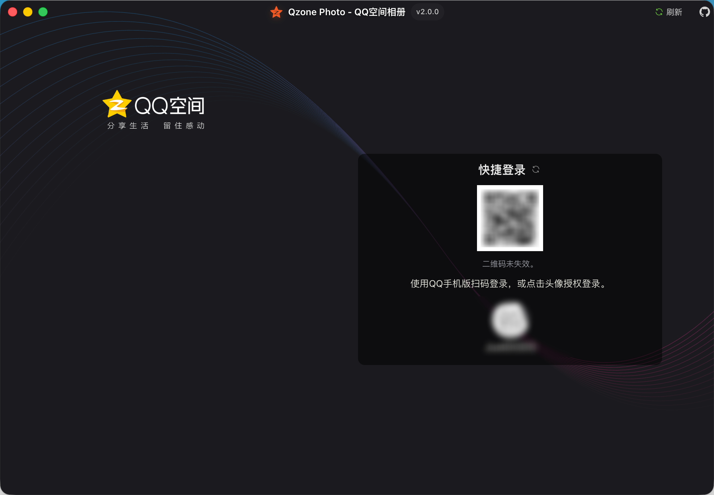
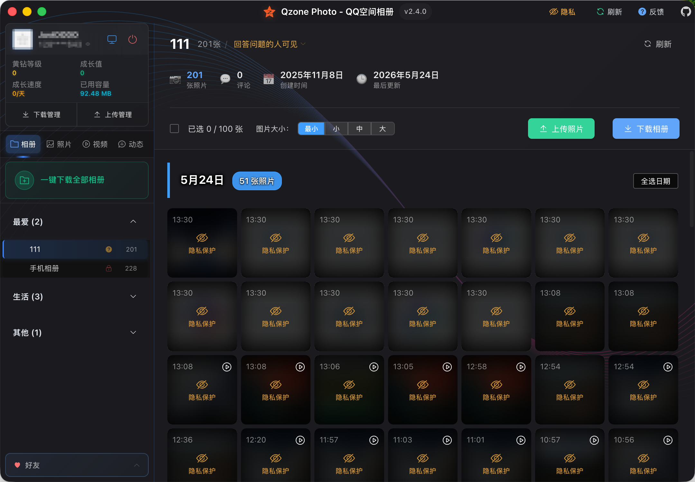
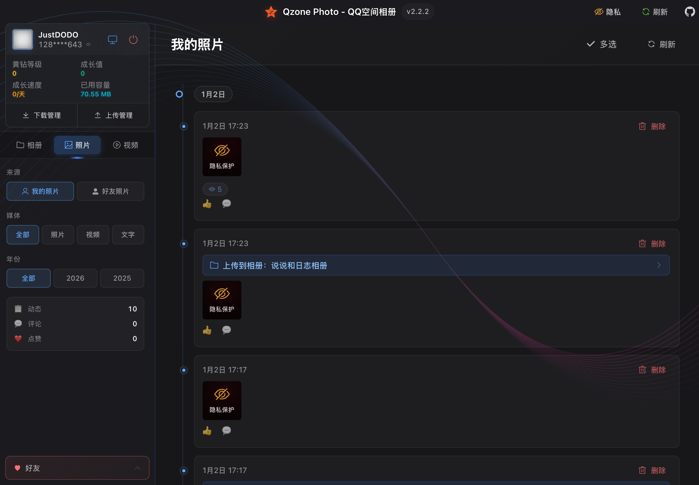
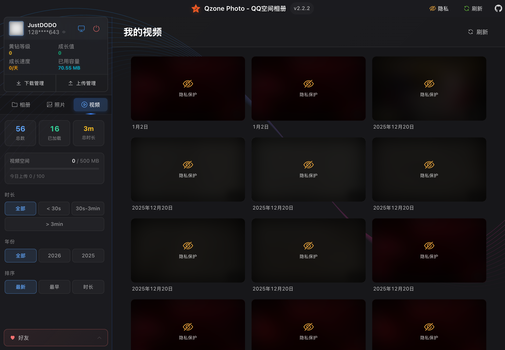
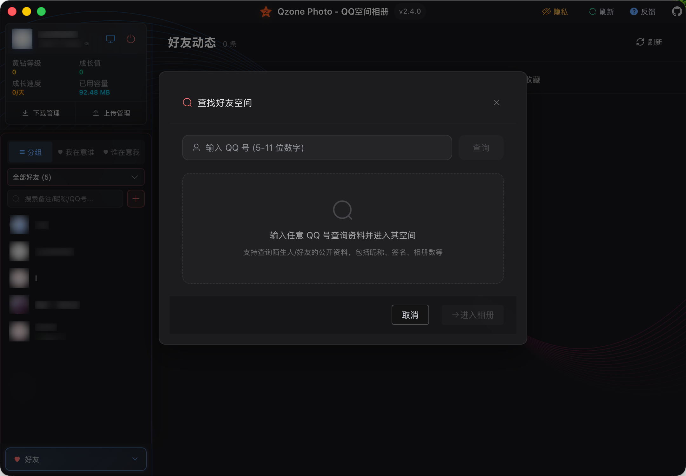
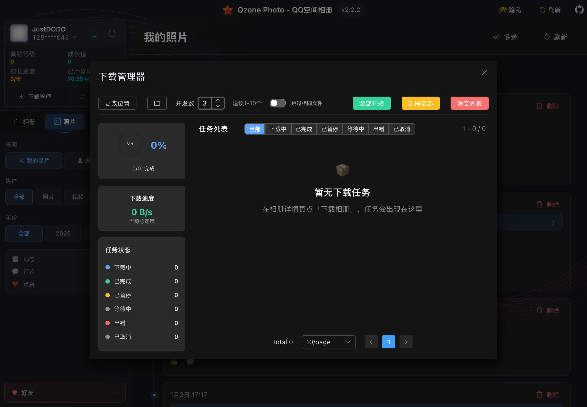
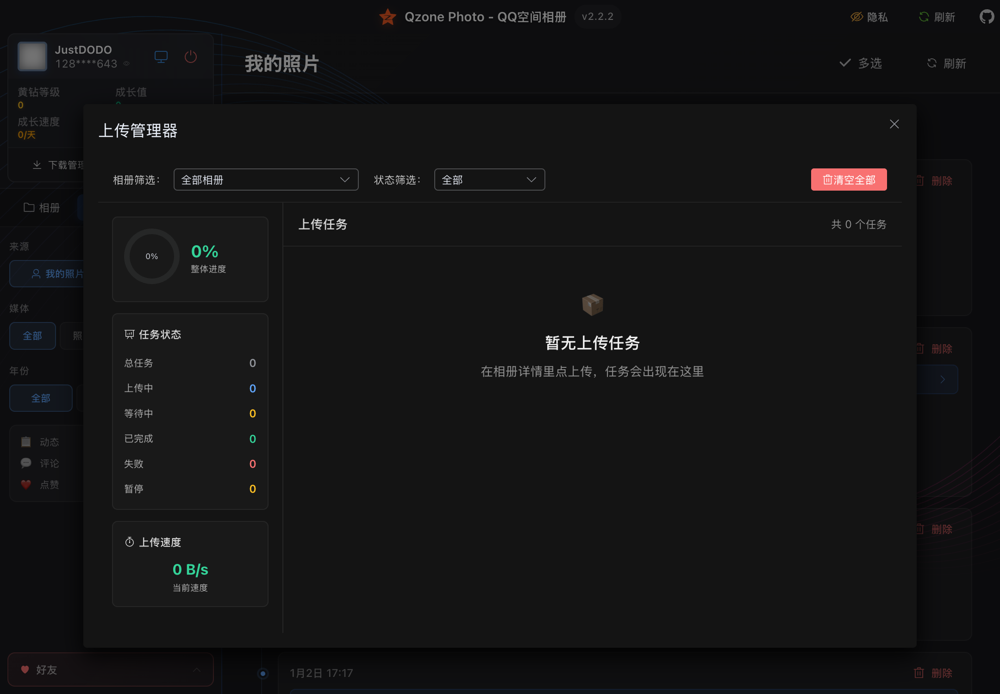

<div align="center">


<h1>Qzone Photo</h1>

<p>
功能强大的QQ空间管理工具<br/>
支持相册下载、照片/视频上传，让你的空间回忆管理更轻松 ✨
</p>

<p>
<a href="https://github.com/11273/QzonePhoto/releases">
<strong>📥 立即下载</strong>
</a>
 · 
<a href="#-快速开始">🚀 快速开始</a>
 · 
<a href="#-功能特性">📺 功能特性</a>
 · 
<a href="#-常见问题解答">❓ 常见问题</a>
</p>

<p>


</p>

</div>

---

## 💝 为什么需要 Qzone Photo？

还记得那些珍藏在QQ空间里的美好回忆吗？

- 🎓 **毕业季的青春照片** - 那些和同窗好友的珍贵合影
- 🌸 **恋爱时光的甜蜜瞬间** - 记录爱情故事的每一个细节
- 👨‍👩‍👧‍👦 **家庭聚会的温馨时刻** - 和家人团聚的快乐时光
- ✈️ **旅行路上的精彩片段** - 世界各地留下的足迹

**时光荏苒，这些回忆太珍贵了，不能只存在云端！**

Qzone Photo 不仅帮助你将这些无价的回忆安全下载到本地，还支持将本地照片/视频上传到QQ空间，让空间管理更加便捷。

## ✨ 功能特性

### 📥 相册下载

- **批量下载相册**：支持一键下载所有相册或选择性下载
- **照片与视频**：同时支持照片和视频内容下载
- **原图下载**：自动获取原始分辨率图片，不下载压缩版
- **断点续传**：意外中断也不怕，继续下载不重复
- **智能分类**：按QQ号和相册名自动整理文件

### 👥 好友相册与好友列表

- **真实好友分组**：直接拉取你的 QQ 好友分组（不再只有"我在意谁/谁在意我"），分组下拉、备注/昵称双行显示，476 人列表也能秒搜
- **三种视角并存**：分组视图 + 我在意谁 + 谁在意我，按需切换
- **好友空间**：点击好友头像直接进入对方相册，所有页面都自动切上下文
- **好友动态照片**：网格卡片布局展示好友最新动态照片
- **好友相册下载**：支持下载好友的公开相册和有权限的相册
- **原图获取**：通过浮层视图接口获取好友相册原图 URL
- **视频下载**：支持下载好友相册中的视频内容
- **智能存储**：好友相册按 `QQ号/好友相册/好友QQ/相册名` 自动归类
- **右键复制 QQ 号**：好友列表里任何一项右键就能复制对方 QQ 号

### 👀 相册访客分析（新）

进入任何一个相册，访客统计自动出现在头部 StatCard 行：

- **总访客数 / 今日新增**：与 QQ 空间网页端"访客 / 评论 / 赞"区域同源接口
- **最近访客列表**：点访客卡展开，头像 + 昵称 + 相对时间（"5 分钟前 / 3 天前"）
- **一键复制 QQ 号**：访客条目点击即复制，方便回访

### 📤 内容上传

- **照片上传**：支持批量上传本地照片到指定相册
- **视频上传**：支持上传视频文件到QQ空间
- **进度跟踪**：实时显示上传进度和状态

### 🎬 媒体预览

- **照片浏览**：高清预览相册中的照片
- **视频播放**：在线播放 QQ 空间视频，支持 HLS 自动适配
- **隐私模式**：截图友好的全局模糊，可随时切换

### 📷 动态时间线（照片 tab）

- **真正的时间线**：左侧轴线 + 日期 chip + 圆环锚点，按日期分组所有动态
- **筛选 chip**：来源（我的/好友）+ 媒体类型（照片/视频/文字）+ 年份，全部前端筛不发请求
- **聚合统计**：已加载动态数 / 评论数 / 点赞数 实时同步到侧栏

### 🔐 权限识别 + 详情弹层

相册列表中通过不同颜色的图标直观展示相册权限：

| 图标 | 权限类型 | 颜色 |
|------|----------|------|
| 无 | 所有人可见 | — |
| 👤 | QQ 好友可见 | 蓝 |
| ❓ | 回答问题可见 | 黄 |
| 🔑 | 密码访问 | 黄 |
| 👁️ | 部分好友可见 | 蓝 |
| 🙈 | 部分好友不可见 | 橙 |
| 🔒 | 仅自己可见 | 红 |

进入相册后，标题旁会显示一行轻量灰字 **"N 张 / 权限文案 ▾"**（与 QQ 空间网页端布局一致）：

- **点击展开**：弹出统一的权限信息卡，含问题/答案、密码提示、允许的功能（转载/分享/圈人/相机信息）、朋友圈范围、相册类型、相册 ID
- **问题/答案/相册 ID 一键复制**：每条点击即复制到剪贴板，配合右上角轻量 toast 提示

### 📋 一键复制（贯穿全 app）

下面这些信息任何时候点一下就能复制，配合 toast 提示「已复制 XXX」：

- 用户卡 / 好友卡 QQ 号（点号码复制，旁边的小眼睛切显隐）
- 好友列表任意条目右键 → 复制 QQ 号
- 相册详情头部权限弹层里：问题、答案、相册 ID
- 访客列表：点条目复制对方 QQ 号
- 标题栏版本号右键 → 复制版本号

### 🛡️ 安全可靠

- **官方接口**：使用QQ空间官方API，数据安全有保障
- **本地存储**：所有文件保存在你的电脑上
- **权限控制**：只能操作你有权限访问的内容
- **开源透明**：代码完全公开，接受社区监督

### 🎨 视觉与体验

- **统一暗色主题**：通过 `design-tokens.css` 把背景层级 / 边框层级 / 文本灰阶 / 主题色全部收敛到 CSS 变量
- **响应式断点**：480 / 768 / 1024 三档自适应，小窗下双列管理器自动堆叠不塌陷
- **过渡缓动统一**：所有 hover / 弹层 / 状态切换走 `cubic-bezier(0.4, 0, 0.2, 1)`，告别硬切

### ⚡ 其他特性

- **跨平台支持**：Windows、macOS、Linux 全平台
- **自动更新**：应用内检查、下载、安装一条龙
- **隐私第一**：截图前一键开启全局模糊，不怕分享时漏内容

## 🚀 快速开始

### 💻 开发环境要求

如果你想从源码运行或参与开发，需要准备以下环境：

- **Node.js**: 建议使用 v18.x 或更高版本
- **包管理器**: pnpm（推荐）

### 🔧 本地运行

1. **克隆项目**

```bash
git clone https://github.com/11273/QzonePhoto.git
cd QzonePhoto
```

2. **安装依赖**

```bash
# 使用 pnpm（推荐）
pnpm install
```

3. **启动开发模式**

```bash
# 开发模式（带热重载）
pnpm dev
```

4. **打包应用**

```bash
# 构建所有平台
pnpm build

# 构建特定平台
pnpm build:win    # Windows
pnpm build:mac    # macOS
pnpm build:linux  # Linux
```

### 📥 直接使用（下载安装包）

#### Windows 系统

- **64位系统**（推荐）：下载 `*-win-x64-setup.exe`
- **32位系统**：下载 `*-win-ia32-setup.exe`
- **不确定**：下载 `*-win-setup.exe`（通用版，文件较大）

#### macOS 系统

- **Apple M系列芯片**（2020年后）：下载 `*-mac-arm64.dmg`
- **Intel芯片**（2020年前）：下载 `*-mac-x64.dmg`
- **DMG打不开**：下载对应的 `.zip` 文件

> 💡 查看芯片：点击  → 关于本机

#### Linux 系统

- **推荐**：下载 `*-linux-x86_64.AppImage`（通用版）
- **Ubuntu/Debian**：下载 `*-linux-amd64.deb`

> 💡 AppImage需要执行权限：`chmod +x *.AppImage`

#### 安装注意事项

- **Windows提示安全警告**：点击"更多信息" → "仍要运行"
- **macOS提示未验证**：系统偏好设置 → 安全性与隐私 → "仍要打开"
- **文件选择**：`.blockmap` 和 `.yml` 文件无需下载

**[👉 前往下载页面](https://github.com/11273/QzonePhoto/releases/latest)**

## 📖 使用指南

### 1️⃣ 登录QQ空间

打开应用后，选择你喜欢的登录方式：

- 📱 **扫码登录**（推荐）：用手机QQ扫一扫，安全快捷
- 💻 **本地登录**：直接使用电脑上已登录的QQ



### 2️⃣ 浏览相册

登录后默认进入相册视图：

- 左侧按 QQ 空间分类（最爱 / 人物 / 风景 / ...）展开相册
- 标题旁灰字 `N 张 / 权限文案 ▾` 点开看完整权限详情（问题答案 / 密码提示 / 允许的功能 / 朋友圈范围 / 相册 ID 都能一键复制）
- 5 个 StatCard：张数 / 评论 / 创建 / 最后更新 / 访客（最后一项点开看最近访客头像 + 时间）



### 3️⃣ 时间线浏览动态

照片 tab 是按时间倒序的动态时间线（包含照片、视频、文字动态）：

- 左侧筛选：来源（我的 / 好友）+ 媒体类型（照片 / 视频 / 文字）+ 年份
- 实时聚合：动态数 / 评论数 / 点赞数
- 右侧每条动态独立卡片，含设备机型、点赞数、评论楼层



> 截图里 @ 的好友昵称 / 头像 / 评论作者已打码处理，仅供 UI 展示。

### 4️⃣ 视频网格

视频 tab 是按上传时间排列的极简网格（学 QQ 空间网页端布局）：

- 左侧 6 项 stats（总数 / 已加载 / 总时长 / 视频空间进度条 / 今日上传配额 / 时长筛选 / 年份筛选 / 排序）
- 网格每张卡片：封面 + 时长 badge + 评论数（如有）+ 上传日期



> 🔒 **隐私保护**：右上角"公开 / 隐私"按钮一键切换全屏模糊，不怕分享屏幕时漏内容。

### 5️⃣ 好友列表 / 进入好友空间

底部"好友"按钮展开抽屉，三种视角：

- **分组**：你的真实 QQ 好友分组 + 全部好友（按 uin 自动去重）
- **我在意谁 / 谁在意我**：原 QZone 亲密度榜
- **搜索**：备注 / 昵称 / QQ 号都能搜
- **右键复制**：任何一条右键直接复制对方 QQ 号



> 截图里好友昵称和头像已打码处理，仅供 UI 展示。

### 6️⃣ 下载管理

选择想要下载的相册：

1. **选择相册** - 勾选要下载的相册
2. **开始下载** - 点击下载按钮
3. **查看进度** - 实时显示下载进度和状态



> 💡 **小贴士**：文件会自动保存到 `电脑图片/Qzone Photo/QQ号码/相册名称/` 文件夹中

### 7️⃣ 上传管理

支持将本地照片和视频上传到QQ空间：

1. **选择相册** - 选择目标相册或创建新相册
2. **选择文件** - 从本地选择要上传的照片/视频
3. **开始上传** - 批量上传，实时显示进度



## 📁 文件保存说明

下载的文件会自动保存到你的电脑照片文件夹下的 `Qzone Photo` 目录中，并按以下格式分类：

```text
电脑照片/QzonePhoto/
├── QQ号码/
│   ├── 相册名称1/
│   │   ├── 照片1.jpg
│   │   ├── 照片2.jpg
│   │   └── 视频1.mp4
│   ├── 相册名称2/
│   │   └── ...
│   └── 好友相册/
│       ├── 好友QQ号1/
│       │   ├── 相册名称1/
│       │   │   └── ...
│       │   └── 相册名称2/
│       │       └── ...
│       └── 好友QQ号2/
│           └── ...
└── ...
```

默认保存路径：

- **Windows**: `C:\Users\你的用户名\Pictures\QzonePhoto\`
- **macOS**: `/Users/你的用户名/Pictures/QzonePhoto/`
- **Linux**: `/home/你的用户名/Pictures/QzonePhoto/`

> 💡 **小贴士**：你也可以在设置中自定义保存位置

## 🔍 常见问题解答

### 💭 使用疑问

<details>
<summary><strong>🤔 可以下载好友的相册吗？</strong></summary>

可以。支持下载好友的公开相册以及你有权限查看的相册（如"QQ好友可见"、已回答问题的相册等）。仅自己可见、密码相册等无权限的相册会自动跳过。

</details>

<details>
<summary><strong>📂 下载的文件保存在哪里？</strong></summary>

默认保存路径：

- **Windows**: `C:\Users\你的用户名\Pictures\QzonePhoto\`
- **macOS**: `/Users/你的用户名/Pictures/QzonePhoto/`
- **Linux**: `/home/你的用户名/Pictures/QzonePhoto/`

文件会按照 `QQ号码/相册名称/` 的结构自动分类整理。

</details>

<details>
<summary><strong>🐌 下载速度很慢怎么办？</strong></summary>

1. 降低并发数到1-2（在设置中调整）
2. 检查网络连接是否稳定
3. 避开网络使用高峰期
4. 关闭其他占用网络的程序

</details>

<details>
<summary><strong>🔐 登录失败怎么办？</strong></summary>

1. 确保网络连接正常
2. 检查QQ是否在手机上正常登录
3. 尝试重新扫码或重启应用
4. 如果使用本地登录，确保电脑QQ正常运行

</details>

### 📱 支持的内容类型

| 类型             | 下载 | 上传 | 预览 |
| ---------------- | ---- | ---- | ---- |
| 📸 **照片**      | ✅   | ✅   | ✅   |
| 🎬 **视频**      | ✅   | ✅   | ✅   |
| 👥 **好友相册**  | ✅   | -    | ✅   |

## 💡 使用小技巧

### 下载技巧

- **批量下载**：支持一键下载所有相册，提高效率
- **合理设置并发数**：建议设置为1-3，既保证速度又避免被限制
- **选择合适时间**：深夜或早晨网络较好时下载
- **断点续传**：下载中断后重新开始会自动跳过已下载的文件

### 上传技巧

- **批量上传**：可以一次选择多个文件进行上传
- **创建相册**：上传前可以创建新相册进行分类
- **格式支持**：支持常见的图片格式（JPG、PNG、GIF等）和视频格式

### 其他技巧

- **定期备份**：将下载的照片备份到移动硬盘或云盘
- **分类整理**：可以按年份或事件重新整理文件夹
- **隐私模式**：在公共场所使用时，隐私模式会自动模糊照片，保护个人隐私

## 🔐 安全保障

- 🏢 **使用官方接口，安全可靠**
- ✅ **直接调用QQ空间官方API，无任何第三方服务器**
- 🛡️ **数据传输加密，与QQ空间官方同等安全级别**
- 💻 **所有数据仅在本地处理，绝不上传到外部服务器**
- 🔍 **开源代码，任何人都可以审查验证安全性**

## ⚠️ 重要提醒

- ⚖️ **请合法合规使用本工具**
- 🔒 **仅下载你有权限访问的内容**
- 💾 **下载内容仅供个人使用**
- 📖 **遵守相关法律法规**

## 🤝 反馈与支持

如果你在使用过程中遇到问题或有改进建议，欢迎：

- 📧 [提交 Issue](https://github.com/11273/QzonePhoto/issues) 反馈问题
- 💬 [参与讨论](https://github.com/11273/QzonePhoto/discussions) 交流
- ⭐ [给项目点个星](https://github.com/11273/QzonePhoto) 支持
<!-- - 🍕 [请我喝咖啡](https://github.com/11273/QzonePhoto) 支持开发 -->

## 📊 项目统计

[](https://github.com/11273/QzonePhoto)

## 📄 许可证

本项目采用 [MIT License](LICENSE) 开源协议，你可以自由使用和修改。

---

<div align="center">


<p><strong>让美好回忆永远陪伴你 💝</strong></p>

<p>


</p>

<p>Made with ❤️ by QzonePhoto Team</p>

</div>
