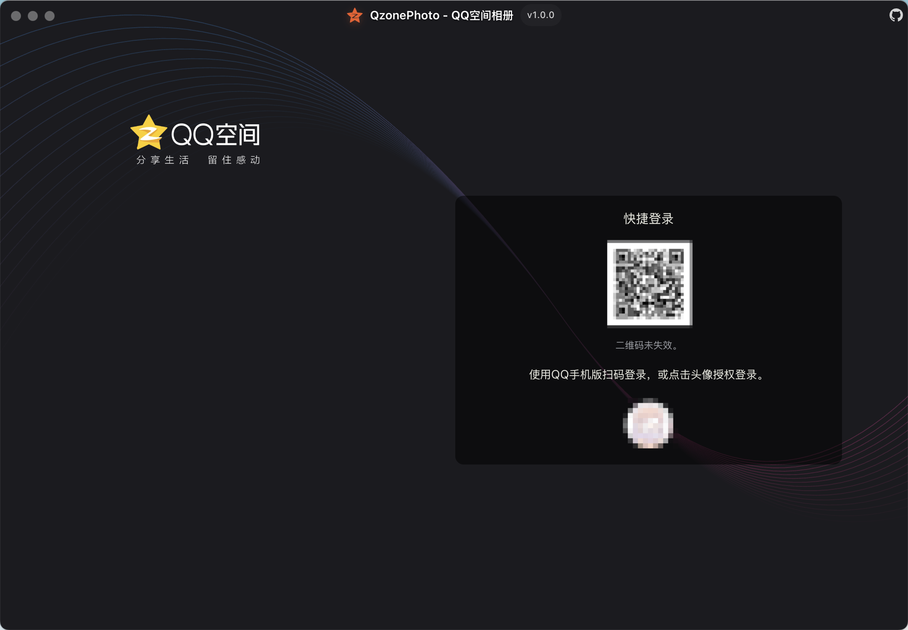

# Qzone Photo - QQ空间相册

> 将珍贵的QQ空间相册回忆安全下载到本地，永久保存美好时光 ✨

<div align="center">

[](https://github.com/11273/QzonePhoto)
[](https://github.com/11273/QzonePhoto/releases)
[](https://github.com/11273/QzonePhoto/releases)

**[📥 立即下载](https://github.com/11273/QzonePhoto/releases) | [📺 使用教程](#-三步开始使用) | [❓ 常见问题](#-常见问题解答)**

</div>

---

## 💝 为什么需要 Qzone Photo？

还记得那些珍藏在QQ空间里的美好回忆吗？

- 🎓 **毕业季的青春照片** - 那些和同窗好友的珍贵合影
- 🌸 **恋爱时光的甜蜜瞬间** - 记录爱情故事的每一个细节
- 👨‍👩‍👧‍👦 **家庭聚会的温馨时刻** - 和家人团聚的快乐时光
- ✈️ **旅行路上的精彩片段** - 世界各地留下的足迹

**时光荏苒，这些回忆太珍贵了，不能只存在云端！**

Qzone Photo 帮助你将这些无价的回忆安全下载到本地，让美好永远陪伴在身边。

## ✨ 为什么选择我们？

### 🚀 简单易用

- **3步完成下载**：登录 → 选择相册 → 开始下载
- **界面简洁直观**：无需复杂设置，老人小孩都会用
- **一键批量下载**：支持多个相册同时下载

### 🛡️ 安全可靠

- **官方接口**：使用QQ空间官方API，无第三方接口，数据安全有保障
- **本地存储**：所有文件保存在你的电脑上，绝不上传到任何服务器
- **权限控制**：只能下载你有权限查看的内容，严格遵守隐私规则
- **开源透明**：代码完全公开，接受社区监督，无任何后门

### ⚡ 功能强大

- **支持照片下载**：JPG、PNG、GIF等格式，保持原始画质
- **断点续传**：意外中断也不怕，继续下载不重复
- **智能分类**：按QQ号和相册名自动整理文件
- **隐私保护**：默认开启隐私模糊模式，避免他人不小心看到照片内容
- **跨平台支持**：Windows、Mac、Linux 都能用

## 🚀 三步开始使用

### 📥 第一步：下载安装

### Windows

- **64位系统**（推荐）：下载 `*-win-x64-setup.exe`
- **32位系统**：下载 `*-win-ia32-setup.exe`
- **不确定**：下载 `*-win-setup.exe`（通用版，文件较大）

### macOS

- **Apple M系列芯片**（2020年后）：下载 `*-mac-arm64.dmg`
- **Intel芯片**（2020年前）：下载 `*-mac-x64.dmg`
- **DMG打不开**：下载对应的 `.zip` 文件

> 查看芯片：点击 → 关于本机

### Linux

- **推荐**：下载 `*-linux-x86_64.AppImage`（通用版）
- **Ubuntu/Debian**：下载 `*-linux-amd64.deb`

> AppImage需要执行权限：`chmod +x *.AppImage`

### 常见问题

- **Windows提示安全警告**：点击"更多信息" → "仍要运行"
- **macOS提示未验证**：系统偏好设置 → 安全性与隐私 → "仍要打开"
- **文件选择**：`.blockmap` 和 `.yml` 文件无需下载

**[👉 前往下载页面](https://github.com/11273/QzonePhoto/releases/latest)**

### 🔑 第二步：登录QQ空间

打开应用后，选择你喜欢的登录方式：

- 📱 **扫码登录**（推荐）：用手机QQ扫一扫，安全快捷
- 💻 **本地登录**：直接使用电脑上已登录的QQ

### 📸 第三步：下载相册

1. **选择相册** - 浏览所有可见相册，选择你想要的
2. **开始下载** - 点击下载按钮，坐等完成！

> 💡 **小贴士**：文件会自动保存到 `电脑图片/QzonePhoto/QQ号码/相册名称/` 文件夹中

> 🔒 **隐私保护**：照片页面默认开启隐私模糊模式，不会被旁边的人看到照片内容，可点击眼睛图标切换

## 📸 应用截图

### 主界面


### 下载进度


### 登录界面



## 📁 文件保存说明

下载的文件会自动保存到你的电脑照片文件夹下的 `QzonePhoto` 目录中，并按以下格式分类：

```
电脑照片/QzonePhoto/
├── QQ号码1/
│   ├── 相册名称1/
│   │   ├── 照片1.jpg
│   │   ├── 照片2.jpg
│   │   └── 视频1.mp4
│   └── 相册名称2/
│       └── ...
└── QQ号码2/
    └── ...
```

> 💡 **小贴士**：文件默认保存在 `电脑照片/QzonePhoto/` 目录下，你也可以在设置中自定义保存位置。

## 🔍 常见问题解答

### 💭 使用疑问

<details>
<summary><strong>🤔 可以下载别人的相册吗？</strong></summary>

不可以。只能下载自己的相册和有权限查看的相册。

</details>

<details>
<summary><strong>📂 下载的文件保存在哪里？</strong></summary>

默认保存路径：

- **Windows**: `C:\Users\你的用户名\Pictures\QzonePhoto\`
- **macOS**: `/Users/你的用户名/Pictures/QzonePhoto/`
- **Linux**: `/home/你的用户名/Pictures/QzonePhoto/`

文件会按照 `QQ号码/相册名称/` 的结构自动分类整理。

</details>

<details>
<summary><strong>🐌 下载速度很慢怎么办？</strong></summary>

1. 降低并发数到1-2（在设置中调整）
2. 检查网络连接是否稳定
3. 避开网络使用高峰期
4. 关闭其他占用网络的程序

</details>

<details>
<summary><strong>🔐 登录失败怎么办？</strong></summary>

1. 确保网络连接正常
2. 检查QQ是否在手机上正常登录
3. 尝试重新扫码或重启应用
4. 如果使用本地登录，确保电脑QQ正常运行

</details>

### 📱 支持的内容类型

| 类型        | 说明       |
| ----------- | ---------- |
| 📸 **照片** | 查看、下载 |
| 🎬 **视频** | 查看、下载 |

## 💡 使用小技巧

- **批量选择**：按住Ctrl键可以选择多个相册同时下载
- **合理设置并发数**：建议设置为1-3，既保证速度又避免被限制
- **选择合适时间**：深夜或早晨网络较好时下载
- **定期备份**：将下载的回忆备份到移动硬盘或云盘
- **分类整理**：可以按年份或事件重新整理文件夹
- **隐私模式**：在公共场所使用时，隐私模式会自动模糊照片，保护个人隐私

## 🔐 安全保障

<div align="center">

🏢 **使用官方接口，安全可靠**

✅ **直接调用QQ空间官方API，无任何第三方服务器**  
🛡️ **数据传输加密，与QQ空间官方同等安全级别**  
💻 **所有数据仅在本地处理，绝不上传到外部服务器**
🔍 **开源代码，任何人都可以审查验证安全性**

</div>

## ⚠️ 重要提醒

<div align="center">

⚖️ **请合法合规使用本工具**

🔒 **仅下载你有权限访问的内容**  
💾 **下载内容仅供个人使用**  
📖 **遵守相关法律法规**

</div>

## 🤝 反馈与支持

如果你在使用过程中遇到问题或有改进建议，欢迎：

- 📧 [提交 Issue](https://github.com/11273/QzonePhoto/issues) 反馈问题
- 💬 [参与讨论](https://github.com/11273/QzonePhoto/discussions) 交流
- ⭐ [给项目点个星](https://github.com/11273/QzonePhoto) 支持
<!-- - 🍕 [请我喝咖啡](https://github.com/11273/QzonePhoto) 支持开发 -->

## 📊 项目统计

[](https://github.com/11273/QzonePhoto)

## 📄 许可证

本项目采用 [MIT License](LICENSE) 开源协议，你可以自由使用和修改。

---

<div align="center">

**让美好回忆永远陪伴你** 💝

_Qzone Photo - 管理你的QQ空间回忆_

[](https://github.com/11273/QzonePhoto)
[](https://github.com/11273/QzonePhoto)
[](https://github.com/11273/QzonePhoto/issues)
[](https://github.com/11273/QzonePhoto/releases)

</div>
